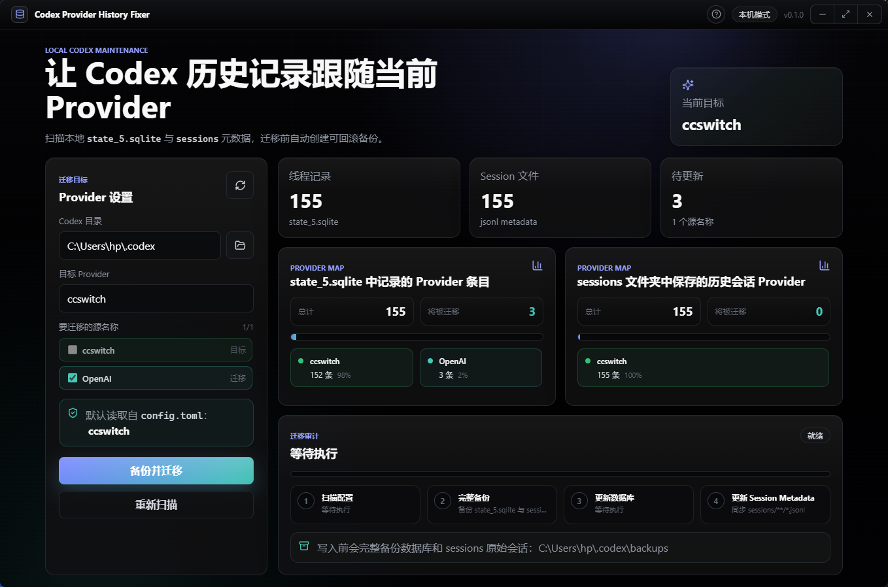
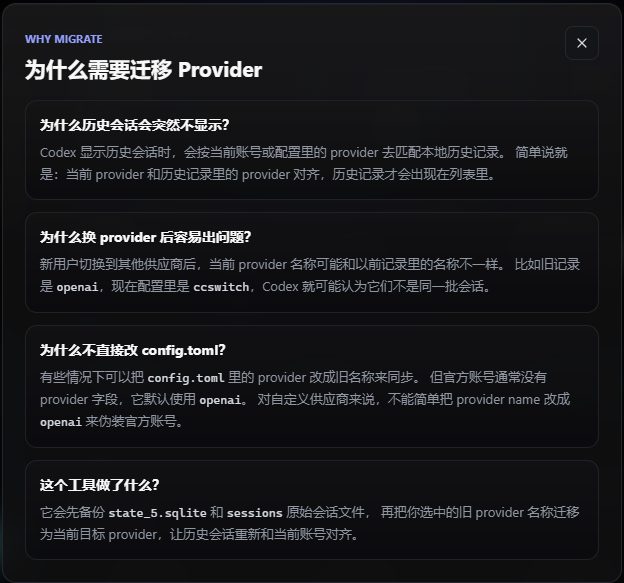

<p align="center">
  
</p>

<h1 align="center">Codex Provider History Fixer</h1>

<p align="center">
  一个用于修复 Codex 切换 Provider 后历史会话不可见问题的本地桌面工具。
</p>

<p align="center">
  <a href="../../releases/latest"></a>
  
  
  
</p>

---

## 项目简介

Codex Provider History Fixer 是一个面向 Codex 用户的小型桌面应用。

当你从官方 OpenAI 账号切换到自定义 Provider，例如 `ccswitch`，或者修改了 Codex 的 `config.toml` Provider 后，原本的历史会话可能突然不显示。

这个工具会扫描你本机的 Codex 历史记录，找出旧 Provider 名称，并把你选择的历史记录迁移到当前 Provider 名称下，让旧会话重新被当前 Codex 账号识别。

整个过程都在本地完成，不上传文件，不需要登录账号。

## 痛点

Codex 的历史会话并不是只看文件是否存在，它还会检查历史记录里的 Provider 是否和当前 Provider 对齐。

也就是说：

```text
当前 Codex Provider == 历史记录中的 Provider
```

只有匹配时，历史会话才会正常出现在列表里。

常见问题包括：

- 以前使用官方 OpenAI 账号，历史记录里默认 Provider 可能是 `openai`
- 后来切换到自定义 Provider，例如 `ccswitch`
- 新旧 Provider 名称不一致，导致旧会话虽然还在本机，但 Codex 不再显示
- 官方账号通常没有显式的 `provider` 字段，自定义 Provider 也不能简单伪装成 `openai`

所以，单纯修改 `config.toml` 并不总是能解决问题。

## 解决方案

Codex Provider History Fixer 解决的是历史记录这一侧的 Provider 不一致问题。

它会：

1. 自动定位本机 Codex 目录
2. 读取当前 `config.toml` 中的目标 Provider
3. 扫描 `state_5.sqlite` 和 `sessions` 中保存的历史 Provider
4. 让用户选择哪些旧 Provider 名称需要迁移
5. 在写入前完整备份数据库和原始会话文件
6. 将选中的旧 Provider 名称修改为目标 Provider

## 界面预览

你可以把截图放到 `docs/images/` 目录中，README 会自动展示。

推荐图片命名：

```text
docs/images/hero.png
docs/images/app_main.png
docs/images/help.png
```

<p align="center">
  
</p>

<p align="center">
  
</p>

## 核心功能

| 功能 | 说明 |
| --- | --- |
| 自动定位 Codex 目录 | 默认扫描当前用户目录下的 `.codex` |
| 读取目标 Provider | 默认使用 `config.toml` 中配置的 Provider |
| Provider 分布分析 | 分别展示数据库和 session 文件中的 Provider 条目 |
| 自定义迁移范围 | 支持勾选 `openai`、`OpenAI`、`codex` 等任意旧名称 |
| 完整备份 | 写入前备份 `state_5.sqlite` 和整个 `sessions` 文件夹 |
| 本地执行 | 不上传数据，不依赖远程服务 |
| 可视化进度 | 展示扫描、备份、数据库更新、Session 更新过程 |

## 技术栈

| 模块 | 技术 |
| --- | --- |
| 桌面容器 | Electron |
| 前端框架 | React |
| 语言 | TypeScript |
| 构建工具 | Vite |
| SQLite 处理 | sql.js |
| TOML 解析 | toml |
| UI 图标 | lucide-react |
| 测试 | Vitest |
| 打包 | electron-builder |
| 自动发布 | GitHub Actions |

## 实现方式

Codex 的本地历史主要分布在两个位置：

```text
<codex-home>/state_5.sqlite
<codex-home>/sessions/**/*.jsonl
```

本工具会分别处理这两类数据。

### 1. 扫描 `state_5.sqlite`

工具会读取 SQLite 数据库中的线程记录，并统计不同 `model_provider` 的数量。

迁移时，只会更新用户勾选的旧 Provider 名称。

### 2. 扫描 `sessions/**/*.jsonl`

Session 文件中会包含 `session_meta` 记录，其中保存了历史会话的 `model_provider`。

工具会遍历所有 `.jsonl` 文件，统计 Provider 分布，并在迁移时更新选中的旧 Provider 名称。

### 3. 写入前备份

迁移前会创建时间戳备份目录：

```text
<codex-home>/backups/provider-migration-YYYYMMDD-HHMMSS
```

备份内容包括：

```text
state_5.sqlite
state_5.sqlite-wal
state_5.sqlite-shm
sessions/
```

如果迁移后发现不符合预期，可以使用备份恢复。

## 下载与安装

### 方式一：GitHub Releases

推荐普通用户使用这个方式。

1. 打开项目的 [Releases 页面](../../releases/latest)
2. 下载最新版本的 Windows 安装包或便携版 `.exe`
3. 双击运行

### 方式二：npm

适合已经安装 Node.js 的开发者。

```bash
npm install -g codex-provider-history-fixer
codex-provider-history-fixer
```

安装完成后，命令会直接启动桌面应用。npm 模式会在安装时下载 Electron 运行时，如果因为网络原因没有安装成功，可以先执行：

```bash
npm install -g electron
```

然后再次运行：

```bash
codex-provider-history-fixer
```

## 本地开发

安装依赖：

```bash
npm install
```

启动开发版：

```bash
npm run dev:electron
```

运行检查：

```bash
npm run typecheck
npm test
```

构建：

```bash
npm run build
```

生成 Windows 包：

```bash
npm run package:win
```

## 发布到 GitHub

项目已经内置 GitHub Actions 发布流程：

```text
.github/workflows/release.yml
```

发布步骤：

```bash
git add .
git commit -m "Release v0.1.0"
git tag v0.1.0
git push origin main
git push origin v0.1.0
```

推送 tag 后，GitHub Actions 会自动：

1. 安装依赖
2. 构建项目
3. 打包 Windows 应用
4. 创建 GitHub Release
5. 上传 `.exe` 等下载文件

用户之后只需要进入 Releases 页面下载即可。

## 安全说明

这个工具会修改本地 Codex 历史记录，因此建议：

- 迁移前关闭 Codex
- 迁移后确认历史会话是否恢复
- 确认无误前不要删除备份目录

工具本身不会上传任何本地文件，也不会访问你的账号信息。

## 适用场景

适合以下用户：

- 从 OpenAI 官方 Codex Provider 切换到自定义 Provider
- 修改过 `config.toml` 中的 Provider 名称
- 本地历史文件仍然存在，但 Codex 界面不显示旧会话
- 想批量统一历史记录中的 Provider 名称

不适合以下情况：

- 本地历史文件已经被删除
- Codex 目录不存在
- 需要恢复远端账号数据

## 路线图

- Windows 安装包和便携版发布
- macOS / Linux 打包支持
- 备份恢复按钮
- 更详细的迁移日志导出
- 自动检测 Provider 不一致风险

## License

MIT
